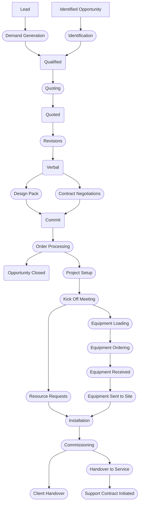

# Integration Project Process

## Current Process

## Notes

- Design Pack
  - Includes Scope of Works and M&E Drawings
  - Chargeable Effort
- Qualified
  - Consider different opportunity / project types
    - Service Only
    - RFP / Tender
    - Box Sale
- Quoting
  - Consider service involvement
- Proposed Change
  - Project created at verbal
