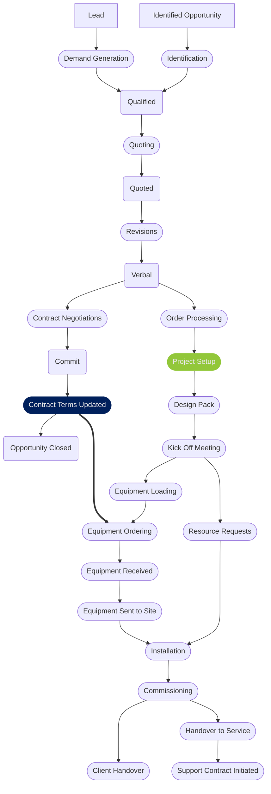

# Proposed Change

```mermaid
graph TB

    %%Styles
    classDef new fill:#00205c,color:#E7E7E7,stroke-width:0;
    classDef change fill:#92C73A,color:#E7E7E7,stroke-width:0;

    %%Stages
    Lead[Lead]
    Demand([Demand Generation])
    Qualified(Qualified)
    Verbal(Verbal)
    Commit(Commit)
    OpportunityClose(Opportunity Closed)

    %%Processes
    Identified[Identified Opportunity]
    Identification([Identification])
    Quoting([Quoting])
    Quoted(Quoted)
    Revisions([Revisions])
    Design([Design Pack])
    Contract([Contract Negotiations])
    Processing([Order Processing])
    ProjectSetup([Project Setup]):::change
    KickOff([Kick Off Meeting])
    EquipmentLoading([Equipment Loading])
    ResourceRequest([Resource Requests])
    Procurement([Equipment Ordering])
    GoodsIn([Equipment Received])
    %% RackFab([Rack Fabrication])
    %% WitnessTest([Witness Testing])
    GoodsOut([Equipment Sent to Site])
    Installation([Installation])
    Commissioning([Commissioning])
    %% ProgrammingOffsite([Offsite Programming])
    ClientHandover([Client Handover])
    InternalHandover([Handover to Service])
    Support([Support Contract Initiated])
    contractConfirmed([Contract Terms Updated]):::new

    %% generation
    Lead-->Demand
    Demand --> Qualified
    Identified-->Identification
    Identification --> Qualified

    %% design
    Qualified-->Quoting
    Quoting --> Quoted
    Quoted --> Revisions
    Revisions --> Verbal


    %% contract
    Verbal --> Contract
    Contract --> Commit
    Commit --> contractConfirmed
    contractConfirmed --> OpportunityClose

    %% mobilisation
    Verbal --> Processing
    Processing --> ProjectSetup
    ProjectSetup --> Design
    Design --> KickOff
    KickOff --> EquipmentLoading
    KickOff --> ResourceRequest


    contractConfirmed ====> Procurement
    EquipmentLoading --> Procurement
    Procurement --> GoodsIn
    GoodsIn --> GoodsOut

    ResourceRequest ----> Installation
    GoodsOut --> Installation

    Installation --> Commissioning
    Commissioning ---> ClientHandover
    Commissioning --> InternalHandover
    InternalHandover --> Support
```
