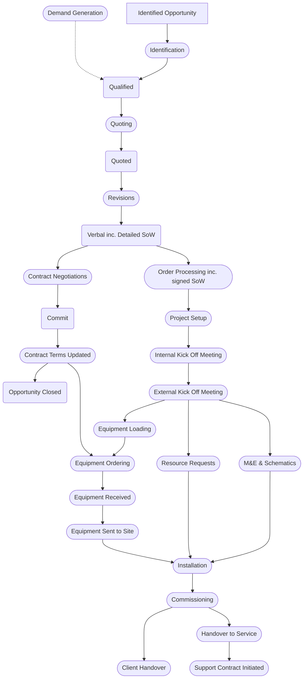

## Integration Process

<!-- tabs:start -->

#### **Work In Progress**

```mermaid
graph TB

    %%Stages
    Lead([Demand Generation])
    Qualified(Qualified)
    Verbal(Verbal inc. Detailed SoW)
    Commit(Commit)
    OpportunityClose(Opportunity Closed)
    %%Processes
    Identified[Identified Opportunity]
    Identification([Identification])
    Quoting([Quoting])
    Quoted(Quoted)
    Revisions([Revisions])
    Design([M&E & Schematics])
    Contract([Contract Negotiations])
    Processing([Order Processing inc. signed SoW])
    ProjectSetup([Project Setup])
    KickOff([Internal Kick Off Meeting])
    EKickOff([External Kick Off Meeting])
    EquipmentLoading([Equipment Loading])
    ResourceRequest([Resource Requests])
    Procurement([Equipment Ordering])
    GoodsIn([Equipment Received])
    GoodsOut([Equipment Sent to Site])
    Installation([Installation])
    Commissioning([Commissioning])
    ClientHandover([Client Handover])
    InternalHandover([Handover to Service])
    Support([Support Contract Initiated])
    contractConfirmed([Contract Terms Updated])
   %%  SignedSow([Signed Scope of Works])

    %% generation

    Lead -..->Qualified
    Identified-->Identification
    Identification --> Qualified

    %% design
    Qualified-->Quoting
    Quoting --> Quoted
    Quoted --> Revisions
    Revisions --> Verbal


    %% contract
    Verbal --> Contract
    Contract --> Commit
    Commit --> contractConfirmed
    contractConfirmed --> OpportunityClose

    %% mobilisation
    Verbal --> Processing
    Processing --> ProjectSetup
    ProjectSetup --> KickOff
    KickOff --> EKickOff
    EKickOff --> EquipmentLoading
    EKickOff --> ResourceRequest
    EKickOff --> Design

    Design ----> Installation


    %% procurement/logistics
    contractConfirmed ----> Procurement
    EquipmentLoading --> Procurement
    Procurement --> GoodsIn
    GoodsIn --> GoodsOut

    ResourceRequest ----> Installation
    GoodsOut --> Installation

    %% install
    Installation --> Commissioning
    Commissioning ---> ClientHandover
    Commissioning --> InternalHandover
    InternalHandover --> Support

    %% support
```

<!-- tabs:end -->
