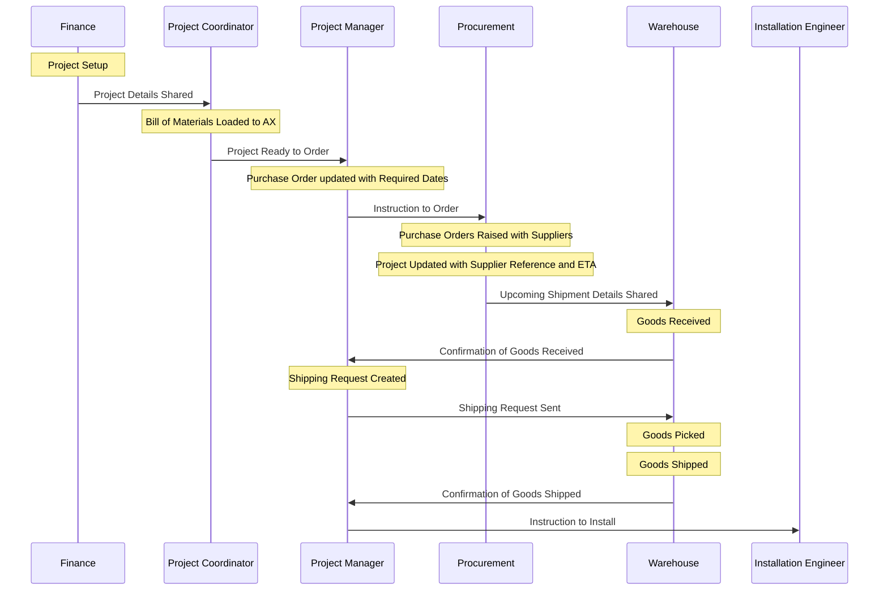

# Inventory Process

## Action Points (Work In Progress)

1. Draft Process Flow & Get Agreement
1. Creating a QR code for inventory tracking
   1. Create an AX report of items on order
   1. Create a unique identifier for each item
   1. Generate a barcode/QR code from unique identifier
1. Upload AX data to SmartSheets
   1. Create an AX report of items on order
   1. Automatically add items to SmartSheets
      1. Load via attachment
      1. Load via SharePoint
   1. Confirm upload amends items
   1. Points to consider
      - AX connectivity issues
        - missing data
        - corrupt data
1. Tracking Items via SmartSheets
   1. Items loaded via AX report
      1. SmartSheets updated with:
         - Project Number
         - Item Number
         - Unique ID (QR code)
         - Item Status = On Order
         - Item Location = Not Received (?not sure on wording, possibly leave as null)
   1. Upon receipt of goods, warehouse:
      1. Prints barcode/QR code and attach to physical item
      1. Attaches barcode/ QR code to item
      1. Scans QR code on item and QR code on Bay Location
      1. SmartSheets updated with:
         - Item Status = Received
         - Item Location = Bay Location
   1. If goods move, warehouse:
      1. Scans QR code on item, scans QR code on current location, scans QR code on new location to indicate item moved
   1. Project Manager creates shipping request
      1. To be confirmed...
      1. Shipping Request Form in SmartSheets?
   1. Shipping request received, warehouse:
      1. Scans QR code on SmartSheets, scans QR code on physical item, scans 'Shipping' QR code
      1. SmartSheets updated with:
         - Item Status = In Transit
         - Item Location = null (?check on this)
1. Shipment received by installation team, install engineer:
   1. Scans QR code on SmartSheets, scans QR code on physical item, scans 'Project' or 'Room' QR code
   1. SmartSheets updated with:
      - Item Status = On Site
      - Item Location = room name (?check on this)

## Overview (Work in Progress)

1. Opportunity transferred from Sales to Operations
1. Item Loaded from BoM to AX Item Requirements
1. Item Added from Item Requirements to Purchase Order
1. Purchase Order placed with Supplier
1. Purchase Order received by the Warehouse
1. Item Received to Warehouse
1. Item Added to Shipping Request
1. Shipping Request sent to Warehouse
1. Items Picked from Shipping Request
1. Shipment Sent to Site
1. Item ownership transferred to customer
1. Items Confirmed from Shipment
1. Serial Number & Room Information added to Item
1. Item Installed
1. Project transferred from Operations to Service

## Process Flow (Work in Progress)

