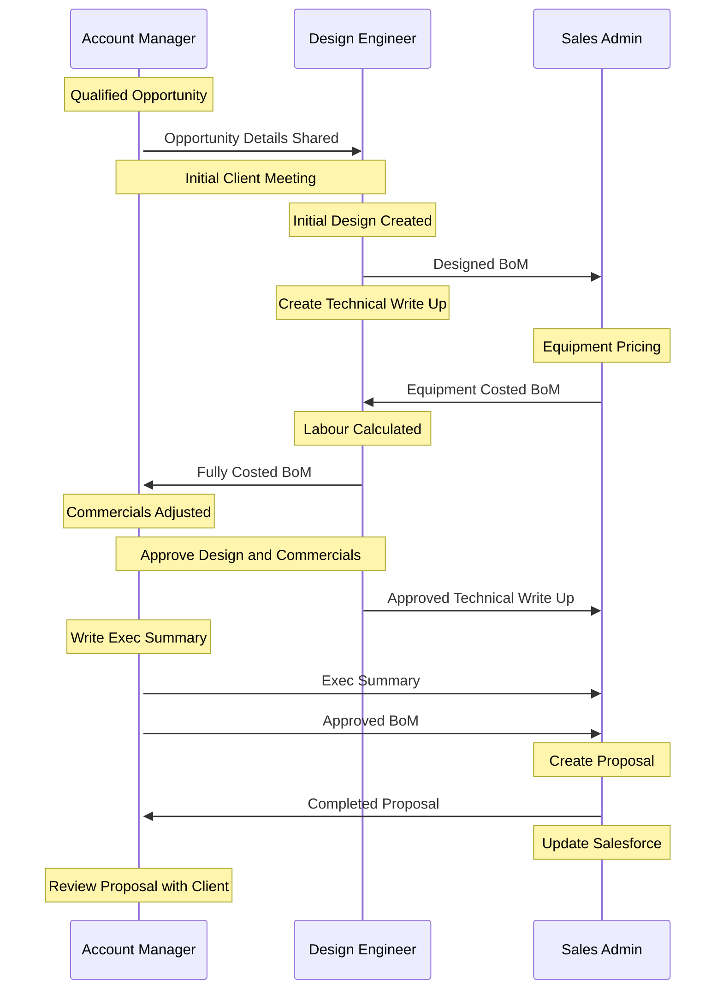

[< Integration Process](./processes/integration.md) / [ Sales](./processes/sales.md)

# Quoting Process

Quoting process begins with a qualified opportunity where the Account Manager has booked a meeting with a client and a Design Engineer.

### Points to Consider

- Add in Service Quoting

### Notes from Sales Admin Guide WIP

Below is a basic overview of the steps undertaken when working on a new SIG (System Integration) opportunity:

1. A new opportunity is added to Salesforce by the account manager
1. Once the opportunity is qualified by teh account manager it will go into the design engineering queue.
1. The design engineer builds the bill of materials - all required part numbers need to be added and hardware/warranty/license/free issued categories need to be defined by the engineer.
1. Once built. the design engineer forwards the BoM to the sales admin team to price. The design engineer is responsible for writing the project overview/solution summary.
1. Sales admin price all items.
1. Add quotes, deal registrations, emails from vendors regarding pricing must be saved in folder 14 on the opportunity folder of the M drive. Only the latest quote must be stored in here, any irrelevant/older quotes can be placed in the archive folder.
1. Once the BoM is completely priced, sales admin should then liaise with the account manager to set the correct margins and apply any discount to specific line items that the AM requests.
1. If support is required, you will need to work with the support team to define whether you can simply use the tools in the BoM or whether a bespoke price is needed which they will supply.
1. Once the BoM is complete, sales admin will then copy and paste the information from the BoM into a pre-completed proposal which should have a solution summary/project overview completed by the engineer. Sales admin will ensure this is presented in a neat fashion.
1. If lease (Taas) pricing is required and the project value is over #4,000 and is at least 60% hardware, at this stage, sales admin team use the figures on the BoM to load financial information into the Tech Data Portal to obtain AVISPLaaS figures. These are then added to the proposal to show the example figures for month costs. The project summary and BoM is also added ot the proposal at this point.
1. Update salesforce with the correct figures - This must be done with every change to a proposal that is made.
1. BoM will need to be sent to UK approvals and will need sign off from the installation team and projects prior to submitting.
1. If the BoM is over 300K GBP, this will need to go through the large opportunity review process (LORP), otherwise send to the approvals email group.
1. Once approved, the sales admin will inform the account manager that they can now release and submit the proposal to their client.
