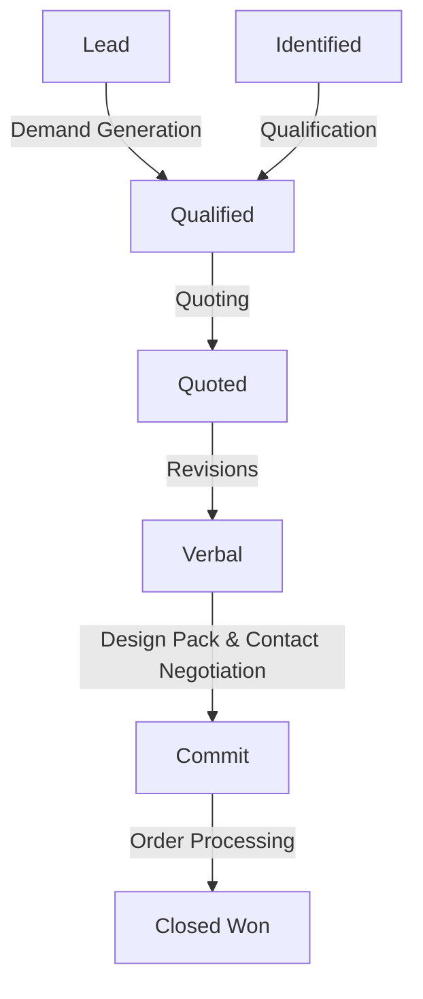
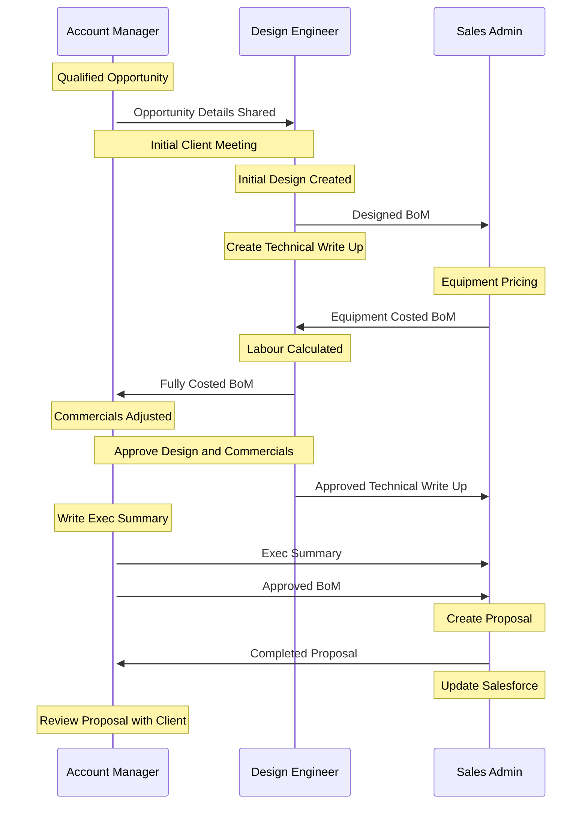

## Sales High Level

## Quoting Process

Quoting process begins with a qualified opportunity where the Account Manager has booked a meeting with a client and a Design Engineer.

### Points to Consider

- Add in Service Quoting

